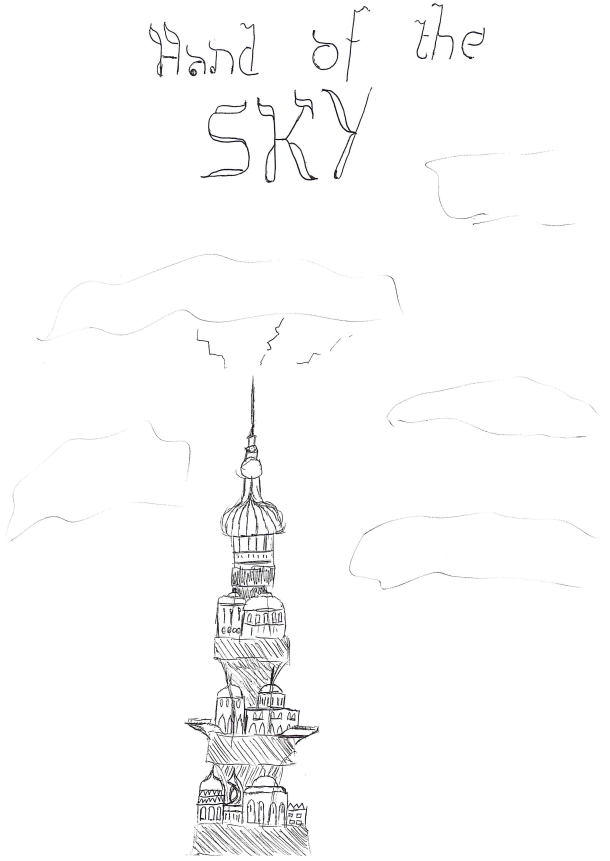

# C5 The Hand of the Sky

The portal leads to a cloudy, windy space, where the group falls endlessly, until they see a new portal opening up to them, and a solid ground of tiles is closing in on them. Some fall gracefully onto the floor, some go face-first. They find themselves on a beautiful balcony overlooking the deserts of Zakhara. They are confronted by a large, blue-skinned figure, the Great and Mighty Ghor, Under-vizier and protector of Genasi Citizens of the Hand of the Sky. He plucked them out of the Plane of Air after being advised so by Gandrayda, a genasi citizen with whom he had a favor. As thanks for saving them from the Plane of Air, they were basically commanded to research problems of a disease outbreak in the lower tiers of the Hand of the Sky. Angering him did not do them any favors for now.

In the bottom tiers of the Hand of the Sky, they are confronted by Cassio, a female Genasi, who demands help from Ghor himself. The group convince Cassio to let them help the citizens of the lower tier. They start investigating the slums, and find that people are infected by a disease that makes them cry, start wander about and wail, and eventually die. By detecting magic, they find that the waters of the slums are infected with something magical, which they manage to trace into the sewers of the slums. After some time and encounters with sludges, they find plants growing into the sewers, reminiscent of a plant called the Sylvan Tears. They follow the routes to a small court with a weird plant growing in the center, and a blood trace leading into a building. They shortly see a creature disappear, before the plant growing in the courts starts attacking the group. They manage to burn it down, and with it its roots, and find a laboratory in the building, with prints of plants, charts of humans and sorts of timelines, mostly written in an alien language. 

The group returns to the upper levels and finds help from a goblin laboratorist, called Alger-Nop Kriega, who identifies the plants and its antidotes. They tell them that the plant grows near the Vestige of Brass, at the Wall of the Wailing Elephant, a mountain range to the south. The plant is known as a potent poison, popular with assassins, causing its victim to die in tears. The laboratorist creates a strong antidote, to drop into the water supply of the slums, which should counteract the effects of the plant, and vials to give to those in need. 

Ghor and Cassio thank the group for their help, and are gifted a Genie's Wish. They can reimburse it any time, using the paper bird to send to the Genie Under-Vizier. They also got some camels 

